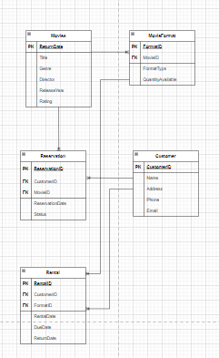

# RentalFlix

# Entity-Relationship Diagram Explanation for RentalFlix

## Entities and Attributes

### Movie
- **MovieID (PK)**: A unique identifier for each movie.
- **Title**: The title of the movie.
- **Genre**: The genre or category of the movie (e.g., Action, Comedy).
- **Director**: The name of the director of the movie.
- **ReleaseYear**: The year the movie was released.
- **Rating**: The movie's rating (e.g., PG, PG-13, R).

### MovieFormat
- **FormatID (PK)**: A unique identifier for each movie format.
- **MovieID (FK)**: A foreign key linking to the movie that this format is associated with.
- **FormatType**: The format of the movie (e.g., DVD, Blu-ray, Digital).
- **QuantityAvailable**: The number of copies available for rent in this format.

### Customer
- **CustomerID (PK)**: A unique identifier for each customer.
- **Name**: The name of the customer.
- **Address**: The address of the customer.
- **Phone**: The contact phone number of the customer.
- **Email**: The email address of the customer.

### Rental
- **RentalID (PK)**: A unique identifier for each rental record.
- **CustomerID (FK)**: A foreign key linking to the customer who rented the movie.
- **FormatID (FK)**: A foreign key linking to the movie format that was rented.
- **RentalDate**: The date when the movie was rented.
- **DueDate**: The date by which the movie should be returned.
- **ReturnDate**: The date when the movie was actually returned (nullable).

### Reservation
- **ReservationID (PK)**: A unique identifier for each reservation record.
- **CustomerID (FK)**: A foreign key linking to the customer who reserved the movie.
- **MovieID (FK)**: A foreign key linking to the movie that was reserved.
- **ReservationDate**: The date when the reservation was made.
- **Status**: The status of the reservation (e.g., active, fulfilled, canceled).

## Relationships

### Movie to MovieFormat (1:M)
- **Description**: A movie can be available in multiple formats (DVD, Blu-ray, Digital). For each movie, there can be multiple format entries in the MovieFormat table.
- **Arrow**: Points from **Movie** to **MovieFormat** indicating that one movie can have many formats.

### Customer to Rental (1:M)
- **Description**: A customer can rent multiple movies. Each rental record is linked to one customer, but a customer may have several rentals over time.
- **Arrow**: Points from **Customer** to **Rental** indicating that one customer can have many rentals.

### Rental to MovieFormat (M:1)
- **Description**: Each rental record is associated with a specific movie format. Many rental records can refer to the same movie format.
- **Arrow**: Points from **Rental** to **MovieFormat** indicating that many rentals are associated with one movie format.

### Movie to Reservation (1:M)
- **Description**: A movie can have multiple reservations. When a movie is reserved by customers, the reservation records are created for each instance.
- **Arrow**: Points from **Movie** to **Reservation** indicating that one movie can have many reservations.

### Customer to Reservation (1:M)
- **Description**: A customer can have multiple reservations. Each reservation record is associated with one customer, but a customer can reserve multiple movies.
- **Arrow**: Points from **Customer** to **Reservation** indicating that one customer can have many reservations.
